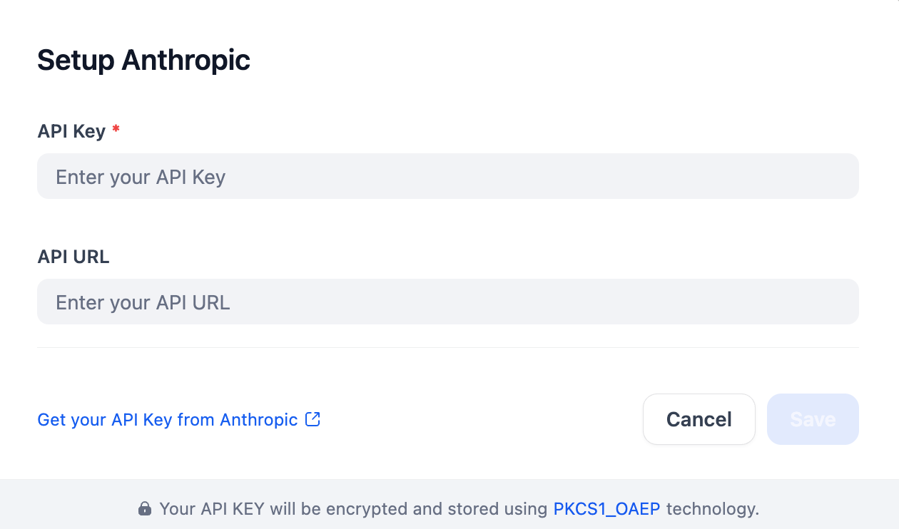

## Overview

Плагин под наш шлюз **Intelion Cloud** — Anthropic-совместимое API (та же Messages API, кастомный base_url). Код-логика (`models/llm/llm.py`) поддерживает произвольный `base_url` и сама подставляет `User-Agent`, если провайдер не `api.anthropic.com`.

## Configure

Введи API-ключ Intelion Cloud (формат `ic-...`) — API URL уже предзаполнен (`https://aiapi.intelion.cloud/anthropic`), менять не нужно, если используется тот же шлюз.

## Prompt-Caching Options

Claude API позволяет пометить отдельные части запроса как _ephemeral_ (кэшируемые). Такие блоки кэшируются на стороне Anthropic — последующие запросы становятся дешевле и быстрее.
Плагин даёт точечные переключатели, чтобы контролировать, **что именно** кэшируется.

| Параметр                          | По умолчанию | Описание                                                                                                                                    |
| ---------------------------------- | ------------ | -------------------------------------------------------------------------------------------------------------------------------------------- |
| `prompt_caching_system_message`   | `true`       | Кэширует содержимое, обёрнутое в `<cache>…</cache>` внутри системного промпта.                                                              |
| `prompt_caching_tool_definitions` | `true`       | Добавляет `cache_control` к каждому определению инструмента в массиве `tools`.                                                              |
| `prompt_caching_images`           | `true`       | Кэширует блоки с изображениями.                                                                                                              |
| `prompt_caching_documents`        | `true`       | Кэширует блоки с PDF-документами.                                                                                                            |
| `prompt_caching_tool_results`     | `true`       | Кэширует блоки `tool_use` / `tool_result`.                                                                                                   |
| `prompt_caching_message_flow`     | `0`          | Если задано положительное целое число _N_, любое текстовое сообщение пользователя/ассистента длиннее _N_ слов кэшируется автоматически. `0` отключает автокэширование. |

**Ограничение Anthropic:** не более **4** блоков с `cache_control` в одном запросе.
Плагин соблюдает это ограничение, расставляя приоритеты в следующем порядке:

1. Изображения / документы
2. Блоки `<cache></cache>` в системном сообщении
3. Крупные текстовые сообщения (порог message-flow)
4. Определения инструментов и результаты их вызовов

Если кандидатов больше четырёх, у блоков с более низким приоритетом `cache_control` автоматически снимается перед отправкой запроса.
