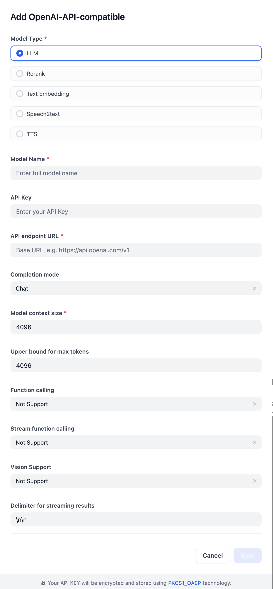

## Overview

Плагин даёт доступ к любым моделям, совместимым с OpenAI API — LLM, реранк, эмбеддинги текста, распознавание речи (STT) и синтез речи (TTS). Достаточно указать конфигурацию (имя модели, API-ключ, базовый URL), чтобы подключить провайдера — например, локально поднятый vLLM, LM Studio или llama.cpp.

## Configure

Настрой OpenAI-API-compatible модель, указав основные параметры (тип, имя, API-ключ, URL) и при необходимости — лимиты контекста/токенов, стриминг и поддержку vision. Сохрани.

### Пример: локальная модель на vLLM

Провайдер настраивается так же, как и для любого другого OpenAI-совместимого эндпоинта — см. `llm-server/` в корне `CyberAI_Vector` (vLLM + Qwen3-32B-AWQ на GPU-сервере):

| Поле | Значение |
| --- | --- |
| Type | `LLM` |
| Model Name | `Qwen/Qwen3-32B-AWQ` |
| API Key | значение `VLLM_API_KEY` из `.env` на GPU-сервере |
| API Base URL | `http://<ip-gpu-сервера>:8000/v1` |
| Completion mode | `Chat` |

Для не-LLM типов моделей (эмбеддинги, реранк, STT, TTS), где плагин сам добавляет `/v1` к URL, указывай базовый адрес без `/v1`, чтобы не получить задвоенный `/v1/v1` путь.
